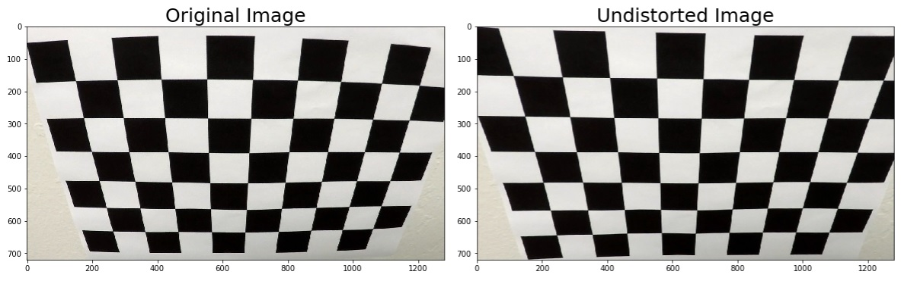
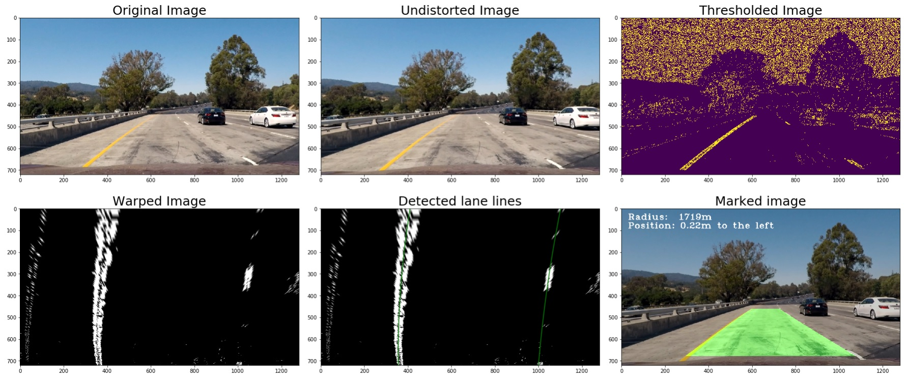
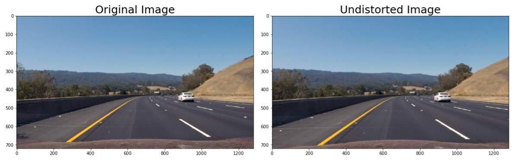
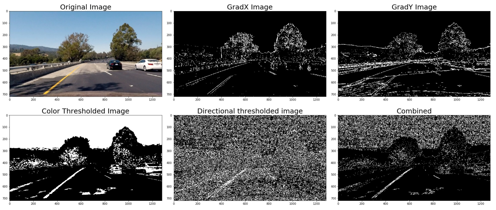
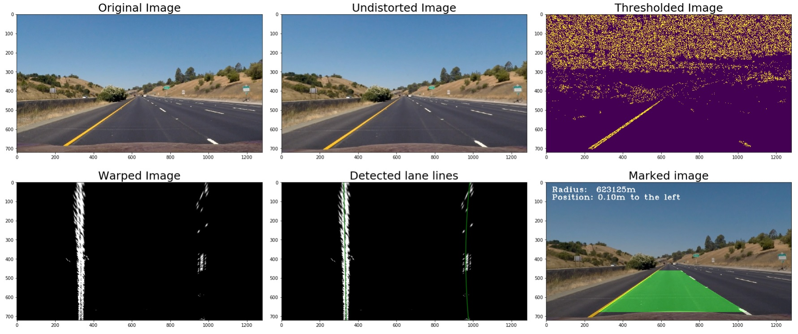
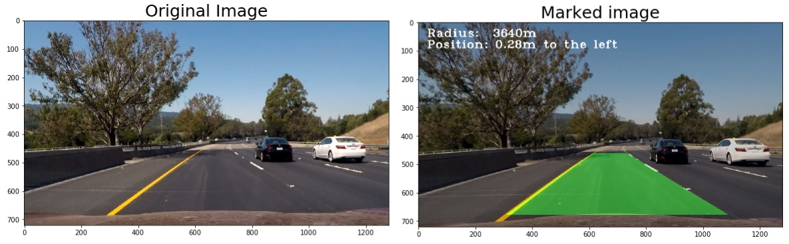

**Advanced Lane Finding Project**

The goals / steps of this project were the following:

* Compute the camera calibration matrix and distortion coefficients given a set of chessboard images.
* Apply a distortion correction to raw images.
* Use color transforms, gradients, etc., to create a thresholded binary image.
* Apply a perspective transform to rectify binary image ("birds-eye view").
* Detect lane pixels and fit to find the lane boundary.
* Determine the curvature of the lane and vehicle position with respect to center.
* Warp the detected lane boundaries back onto the original image.
* Output visual display of the lane boundaries and numerical estimation of lane curvature and vehicle position.

[//]: # (Image References)

[image1]: ./examples/undistort_output.png "Undistorted"
[image2]: ./test_images/test1.jpg "Road Transformed"
[image3]: ./examples/binary_combo_example.jpg "Binary Example"
[image4]: ./examples/warped_straight_lines.jpg "Warp Example"
[image5]: ./examples/color_fit_lines.jpg "Fit Visual"
[image6]: ./examples/example_output.jpg "Output"
[video1]: ./project_video.mp4 "Video"

## [Rubric](https://review.udacity.com/#!/rubrics/571/view) Points

#### 1. Provide a Writeup / README that includes all the rubric points and how you addressed each one.  You can submit your writeup as markdown or pdf.  [Here](https://github.com/udacity/CarND-Advanced-Lane-Lines/blob/master/writeup_template.md) is a template writeup for this project you can use as a guide and a starting point.  

My writeup is this README.md file

### Camera Calibration

#### 1. Briefly state how you computed the camera matrix and distortion coefficients. Provide an example of a distortion corrected calibration image.

The camera calibration part is in the second cell off my IPython notebook. All the called functions are part of my line_detector class (first cell of my notebook). The function responsible for the calibration part is called "calibrate_camera" and can be used like this:

detector.calibrate_camera(images, (9,6))

As input, it requires a list of calibration image files and the size of the chessboard image. The rest is calculated as following:

"object points" are be the (x, y, z) coordinates of the chessboard corners in the world. Assuming the chessboard is fixed on the (x, y) plane at z=0, the object points are the same for each calibration image.  Thus, `objp` is a replicated array of coordinates, and `objpoints` will be appended with a copy of it every time the chessboard corners are detected in a test image.  `imgpoints` will be appended with the (x, y) pixel position of each of the corners in the image plane with each successful chessboard detection.  

Using `objpoints` and `imgpoints` the camera calibration and distortion coefficients can be computed using the `cv2.calibrateCamera()` function. 

The results are stored in the line_detector class itself. The distortion-correction is then can be made easily using the "undistort" function of the class.

undistorted = detector.undistort(cal_img)

### Pipeline (single images)

My line lane detecting pipeline consists of the following steps:

1. Apply distortion correction
2. Create a thresholded binary image
3. Transform the thresholded image to bird's eye view using perspective transform
4. 
    1. Detect the left and right lane lines separately through computing the historgram of the transformed image in moving windows as an initial step then using highly targeted search on the following images
    2. Fit a second order polynomial on both lane lines using a smoothing filter which also takes the previous results into account
    3. Calculate the curvature of the lane as well as the relative position to the center of the lane
5. Transform the detected lane area back to the original frame and draw it on top of the original image and annotate it 

The ouputs of these steps can be seen on the following images:

#### 1. Provide an example of a distortion-corrected image.

The distortion correction was already described and demonstrated in the camera calibration section. 

An additional example from the test set (test3.jpg):

#### 2. Describe how (and identify where in your code) you used color transforms, gradients or other methods to create a thresholded binary image.  Provide an example of a binary image result.

I used a combination of color and gradient thresholds to generate a binary image. The class member function for this is called 'threshold_image'. This function creates a HLS copy of the input (already distortion corrected) image and creates four binary layers:
    1. gradx (Sobel-X) thresholding on the L channel of the HLS image
    2. grady (Sobel-Y) thresholding on the L channel of the HLS image
    3. color thresholding on the S channel of the HLS image 
    4. directional thresholding on the S channel
    
These images are then combined according to the following logic:
combined_binary[(((gradx == 1) & (grady == 1) | (color == 1)) & (direct == 1))] = 1

#### 3. Describe how (and identify where in your code) you performed a perspective transform and provide an example of a transformed image.

The perspective correction funtion is called `warp_image` in my class. For defining the source points first a separate, `set_roi` function shall be called. The destination points are given through the `get_warp` function which also calculates and stores the resulting transformation in the `M` member of the class. This enables to easily transform any image using the calculated parameters. For this, I created the `warp_image` function.

The defined frames are the following:

`detector.set_roi((580,460), (700, 460), (1030, 678), (250, 678))`
`detector.get_warp(test_img, (320, 0))`

I carefully defined the source frame so that it's middle point in X dimension is the same as the source image's. This becomes important when calculating the car's relative position to the center of the lane. If the center of the transformed image is also the center of the original image then the calculated offset (on the warped image) does not have to be adjusted.

I verified that my perspective transform was working as expected by drawing the `src` and `dst` points onto a test image and its warped counterpart to verify that the lines appear reaonably parallel in the warped image. These are the results on one of the given test images (straight_lines1.jpg):

#### 4. Describe how (and identify where in your code) you identified lane-line pixels and fit their positions with a polynomial?

I used the demonstrated sliding window approach in my code and extended it so that it "memorises" the location of the lane line and use a highly targeted search in the following images. It helps a lot in areas where the contrast is low on the thresholded image at the position of the line and there are very strong noise as well (e.g on the bridge where the left lane line is hard to follow but the shadow of the concrete "wall" between the two sides of the highway creates very strong gradients on the thresholded image which could otherwise easily fool the algorithm)

The lane detector function is called `find_lane_lines`. If there is a previous result, the function returns the results of the targeted search which is called `findnext`. 

Remark: this process could be improved because it is not checked what the results of the `findnext` function are. It is possible that there are no lines to be found. In this case, as a fallback, the process could continue with the histogram searching.

#### 5. Describe how (and identify where in your code) you calculated the radius of curvature of the lane and the position of the vehicle with respect to center.

The radius of the curvature of the lane and the position of the car (with respect to the center) are calculated in the function `get_results`. This function is also responsible to return the area of the lane (the area as an image between the left and right lane lines). This area then will be transformed back to the original frame of the image and drawn on it using the `weighted_img` funtion.

#### 6. Provide an example image of your result plotted back down onto the road such that the lane area is identified clearly.

As described in section 5 the calculation of the area is done in the `get_results` function and the transformation and drawing is handled in the main function of the class (`process_image`)

---

### Pipeline (video)

#### 1. Provide a link to your final video output.  Your pipeline should perform reasonably well on the entire project video (wobbly lines are ok but no catastrophic failures that would cause the car to drive off the road!).

My complete pipline (apart from the camera calibration and the definition of the source and destination points of the perspective transform) looks like this (the `process_image(image)` function):

`undistorted = self.undistort(image)`
`thresholded = self.threshold_image(undistorted)`
`warped = self.warp_image(thresholded)`
`(left_fit, right_fit) = self.find_lane_lines(warped)`
`(radius, position, lane) = self.get_results(warped)`
`area = np.zeros_like(image)`
`area[:,:,1] = self.unwarp_image(lane)*255`
`result = self.weighted_img(area, image, α=0.8, β=0.4, λ=0.)`

Here's a [link to my video result](./output.mp4)

### Discussion

#### 1. Briefly discuss any problems / issues you faced in your implementation of this project.  Where will your pipeline likely fail?  What could you do to make it more robust?

The image filtering techniques I used are great in detecting the lane lines but also quite sensitive to noises. 
Here are some examples:
1. If the lane lines are too close to the border of the road (the tarmac) or to the middle of the highway the contrast could easily be as big or even bigger than on the lanes
2. If the lane line is detoured (eg. for construction purposes) the original lane is usually visible as well - in this case also the colour could be important (which is not used at all at the moment)
3. Shadows, especially those parallel to the lane lines
4. Damages or repaired sections on the road
5. Other cars (especially trucks) that makes impossible to see both lane lines
6. Strong curves

I also did not factor in video capture problems (over or underexposed images, rapidly changing lighting conditions) which are usually present in a live environment (strong shadows (eg. in a forest) in the middle of the day, tunnels etc)

A more robust solution should probably use some deep learning techniques because those can better adapt to various conditions. A clever parameter optimizer (for tuning the parameters of the filters) could also improve the accuracy of the current setup. 

Apart from the problems in the accuracy department, the biggest problem with the current pipeline is that it can not be used in a real-time environment because it is simply too slow. For speeding it up, limiting the area of the search could be a good starting point (eg. only using the lower half of the images)
