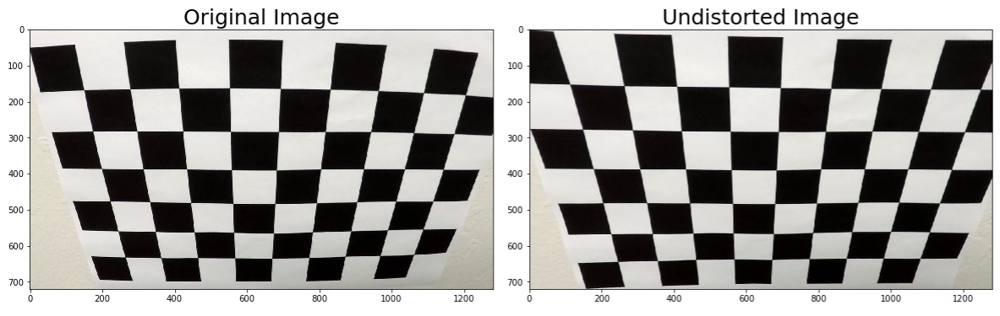
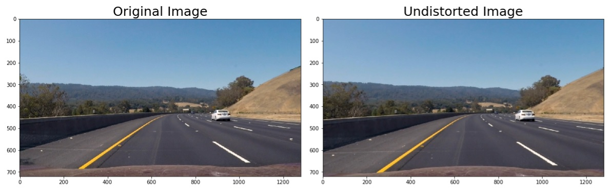
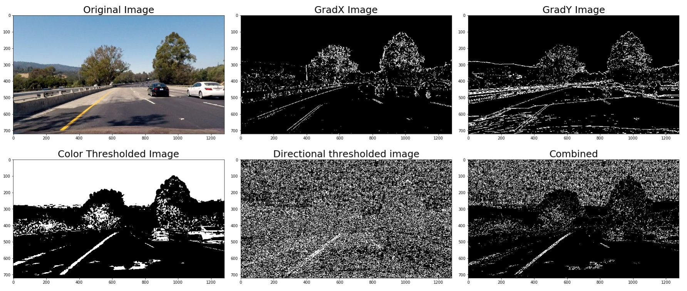

**Advanced Lane Finding Project**

The goals / steps of this project were the following:

* Compute the camera calibration matrix and distortion coefficients given a set of chessboard images.
* Apply a distortion correction to raw images.
* Use color transforms, gradients, etc., to create a thresholded binary image.
* Apply a perspective transform to rectify binary image ("birds-eye view").
* Detect lane pixels and fit to find the lane boundary.
* Determine the curvature of the lane and vehicle position with respect to center.
* Warp the detected lane boundaries back onto the original image.
* Output visual display of the lane boundaries and numerical estimation of lane curvature and vehicle position.

[//]: # (Image References)

[image1]: ./examples/undistort_output.png "Undistorted"
[image2]: ./test_images/test1.jpg "Road Transformed"
[image3]: ./examples/binary_combo_example.jpg "Binary Example"
[image4]: ./examples/warped_straight_lines.jpg "Warp Example"
[image5]: ./examples/color_fit_lines.jpg "Fit Visual"
[image6]: ./examples/example_output.jpg "Output"
[video1]: ./project_video.mp4 "Video"

## [Rubric](https://review.udacity.com/#!/rubrics/571/view) Points

#### 1. Provide a Writeup / README that includes all the rubric points and how you addressed each one.  You can submit your writeup as markdown or pdf.  [Here](https://github.com/udacity/CarND-Advanced-Lane-Lines/blob/master/writeup_template.md) is a template writeup for this project you can use as a guide and a starting point.  

My writeup is this README.md file

### Camera Calibration

#### 1. Briefly state how you computed the camera matrix and distortion coefficients. Provide an example of a distortion corrected calibration image.

The camera calibration part is in the second cell off my IPython notebook. All the called functions are part of my line_detector class (first cell of my notebook). The function responsible for the calibration part is called "calibrate_camera" and can be used like this:

detector.calibrate_camera(images, (9,6))

As input, it requires a list of calibration image files and the size of the chessboard image. The rest is calculated as following:

"object points" are be the (x, y, z) coordinates of the chessboard corners in the world. Assuming the chessboard is fixed on the (x, y) plane at z=0, the object points are the same for each calibration image.  Thus, `objp` is a replicated array of coordinates, and `objpoints` will be appended with a copy of it every time the chessboard corners are detected in a test image.  `imgpoints` will be appended with the (x, y) pixel position of each of the corners in the image plane with each successful chessboard detection.  

Using `objpoints` and `imgpoints` the camera calibration and distortion coefficients can be computed using the `cv2.calibrateCamera()` function. 

The results are stored in the line_detector class itself. The distortion-correction is then can be made easily using the "undistort" function of the class.

undistorted = detector.undistort(cal_img)




### Pipeline (single images)

My line lane detecting pipeline consists of the following steps:

1. Apply distortion correction
2. Create a thresholded binary image
3. Transform the thresholded image to bird's eye view using perspective transform
4. 
    1. Detect the left and right lane lines separately through computing the historgram of the transformed image in moving windows as an initial step then using highly targeted search on the following images
    2. Fit a second order polynomial on both lane lines using a smoothing filter which also takes the previous results into account
    3. Calculate the curvature of the lane as well as the relative position to the center of the lane
5. Transform the detected lane area back to the original frame and draw it on top of the original image and annotate it 


The ouputs of these steps can be seen on the following images:


#### 1. Provide an example of a distortion-corrected image.

The distortion correction was already described and demonstrated in the camera calibration section. 

An additional example from the test set (test3.jpg):



#### 2. Describe how (and identify where in your code) you used color transforms, gradients or other methods to create a thresholded binary image.  Provide an example of a binary image result.

I used a combination of color and gradient thresholds to generate a binary image. The class member function for this is called 'threshold_image'. This function creates a HLS copy of the input (already distortion corrected) image and creates four binary layers:
    1. gradx (Sobel-X) thresholding on the L channel of the HLS image
    2. grady (Sobel-Y) thresholding on the L channel of the HLS image
    3. color thresholding on the S channel of the HLS image 
    4. directional thresholding on the S channel
    
These images are then combined according to the following logic:
combined_binary[(((gradx == 1) & (grady == 1) | (color == 1)) & (direct == 1))] = 1



#### 3. Describe how (and identify where in your code) you performed a perspective transform and provide an example of a transformed image.

The code for my perspective transform includes a function called `warper()`, which appears in lines 1 through 8 in the file `example.py` (output_images/examples/example.py) (or, for example, in the 3rd code cell of the IPython notebook).  The `warper()` function takes as inputs an image (`img`), as well as source (`src`) and destination (`dst`) points.  I chose the hardcode the source and destination points in the following manner:

```python
src = np.float32(
    [[(img_size[0] / 2) - 55, img_size[1] / 2 + 100],
    [((img_size[0] / 6) - 10), img_size[1]],
    [(img_size[0] * 5 / 6) + 60, img_size[1]],
    [(img_size[0] / 2 + 55), img_size[1] / 2 + 100]])
dst = np.float32(
    [[(img_size[0] / 4), 0],
    [(img_size[0] / 4), img_size[1]],
    [(img_size[0] * 3 / 4), img_size[1]],
    [(img_size[0] * 3 / 4), 0]])
```

This resulted in the following source and destination points:

| Source        | Destination   | 
|:-------------:|:-------------:| 
| 585, 460      | 320, 0        | 
| 203, 720      | 320, 720      |
| 1127, 720     | 960, 720      |
| 695, 460      | 960, 0        |

I verified that my perspective transform was working as expected by drawing the `src` and `dst` points onto a test image and its warped counterpart to verify that the lines appear parallel in the warped image.

![alt text][image4]

#### 4. Describe how (and identify where in your code) you identified lane-line pixels and fit their positions with a polynomial?

Then I did some other stuff and fit my lane lines with a 2nd order polynomial kinda like this:

![alt text][image5]

#### 5. Describe how (and identify where in your code) you calculated the radius of curvature of the lane and the position of the vehicle with respect to center.

I did this in lines # through # in my code in `my_other_file.py`

#### 6. Provide an example image of your result plotted back down onto the road such that the lane area is identified clearly.

I implemented this step in lines # through # in my code in `yet_another_file.py` in the function `map_lane()`.  Here is an example of my result on a test image:

![alt text][image6]

---

### Pipeline (video)

#### 1. Provide a link to your final video output.  Your pipeline should perform reasonably well on the entire project video (wobbly lines are ok but no catastrophic failures that would cause the car to drive off the road!).

Here's a [link to my video result](./project_video.mp4)

---

### Discussion

#### 1. Briefly discuss any problems / issues you faced in your implementation of this project.  Where will your pipeline likely fail?  What could you do to make it more robust?

Here I'll talk about the approach I took, what techniques I used, what worked and why, where the pipeline might fail and how I might improve it if I were going to pursue this project further.  
